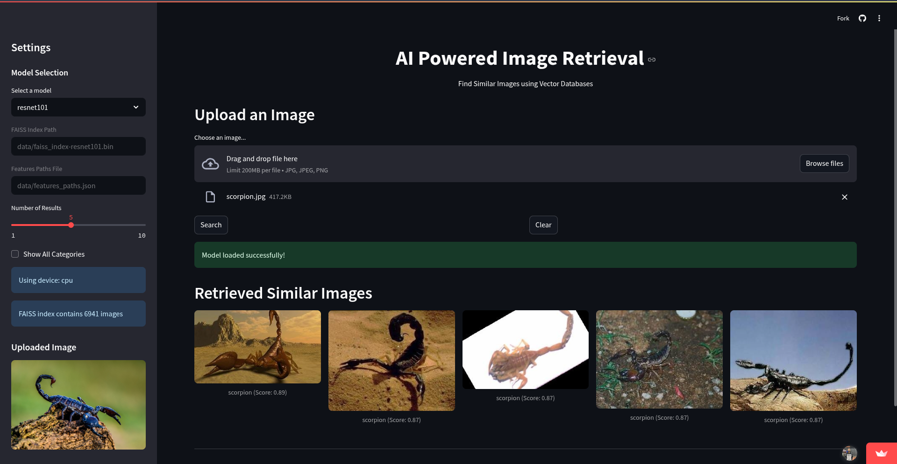

# 🖼️ Vector-Based Image Retrieval

This project implements a **content-based image retrieval system** using deep learning and vector similarity search. Given a query image, the system retrieves visually or semantically similar images from an indexed dataset using fine-tuned ResNet models on Caltech101 datasets and FAISS.

---

## 🚀 Features

- 🔍 **Image-to-Image Retrieval** using visual features
- 🧠 Supports multiple backbones: `ResNet18`, `ResNet50`, and `ResNet101`
- ⚡ Efficient similarity search using **FAISS**
- 🖥️ **[Streamlit-powered demo app](https://vector-based-image-retrieval.streamlit.app/)** for interactive retrieval


   Demo Link: [https://vector-based-image-retrieval.streamlit.app/](https://vector-based-image-retrieval.streamlit.app/)
---

## 🧰 Architecture

1. **Feature Extraction**  
   the layer4 of ResNet models are fine-tuned for the Caltech dataset for classification purpose and then used for feature extraction. The output is then transformed to 128 dimensions using a fully connected layer. The feature vectors are then normalized.
   - **ResNet18**: 512-dimensional feature vector
   - **ResNet50**: 2048-dimensional feature vector
   - **ResNet101**: 2048-dimensional feature vector

2. **Vector Indexing**  
   FAISS builds an index from extracted vectors for fast approximate nearest neighbor search.

3. **Retrieval Workflow**  
   - Query image → ResNet → Feature Vector  
   - Feature Vector → FAISS → Top-K Similar Images


---
## 🛠️ Setup
### 1. Clone the repository

```bash
git clone
cd vector-based-image-retrieval
```
### 2. Create a conda environment

```bash
conda create -n image-retrieval python=3.10
```
### 3. Activate the environment

```bash
conda activate image-retrieval
```
### 4. Install dependencies

```bash
pip install -r requirements.txt
```

### 5. Launch the app
```bash
streamlit run app.py
```